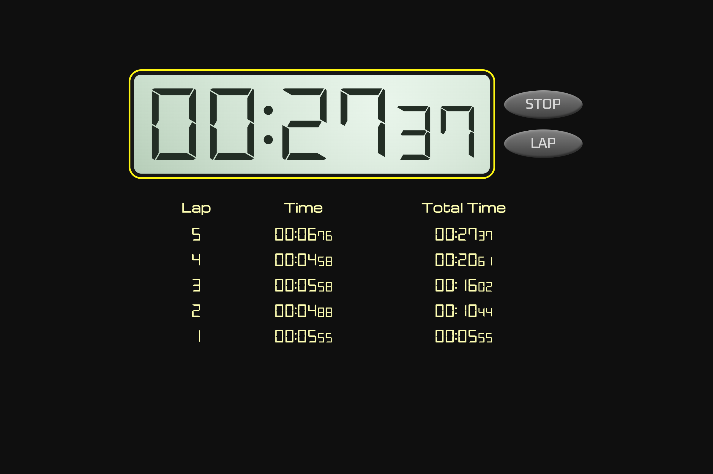

# ⏱️ Stopwatch Web App

A lightweight, responsive, and visually polished stopwatch web application built using HTML, CSS, and JavaScript. It supports start, stop, reset, and lap tracking, with a seven-segment–style digital display.

---

## 🚀 Features
### Real-time Stopwatch
- Millisecond-accurate timing using performance.now()
- Smooth animation loop via requestAnimationFrame

### Lap Functionality
- Records individual lap times
- Shows both lap time and total elapsed time
- Automatically updates lap table with each new lap

## Digital Stopwatch-themed UI
- Seven-segment digital display
- Responsive layout with CSS variables
- Styled control buttons with gradients and soft shadows

---

## Images
